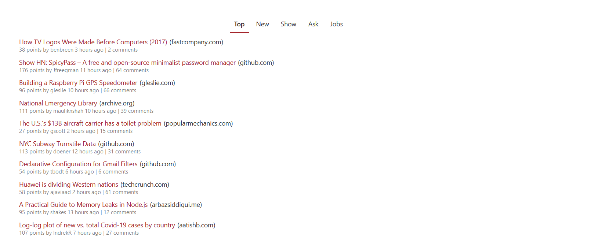

# sp-hacker-news   
A simple Hacker News client for SharePoint Online.

## Doc
* [HNPWA API](https://github.com/tastejs/hacker-news-pwas/blob/master/docs/api.md)
* [SharePoint Framework](https://docs.microsoft.com/en-us/sharepoint/dev/spfx/sharepoint-framework-overview)
* [Fluent UI](https://developer.microsoft.com/en-us/fluentui#/)

## License
[MIT](LICENSE)
